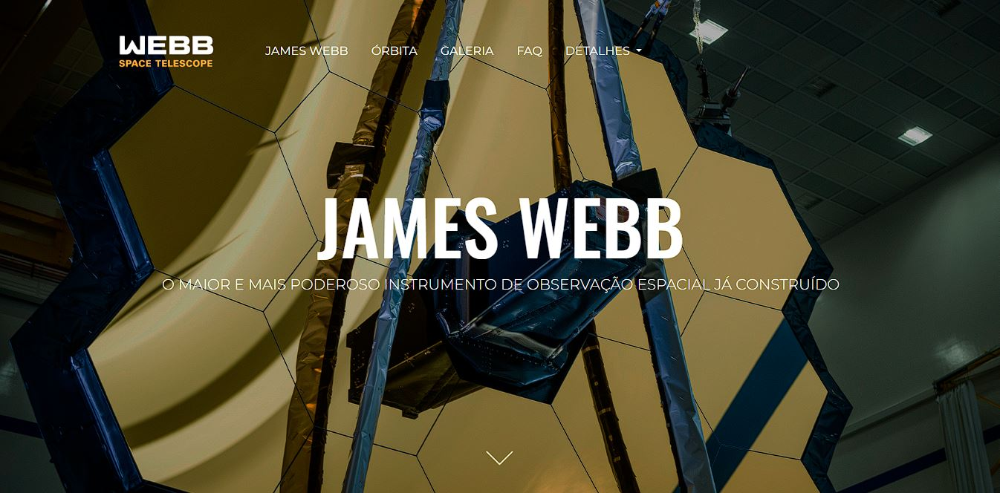
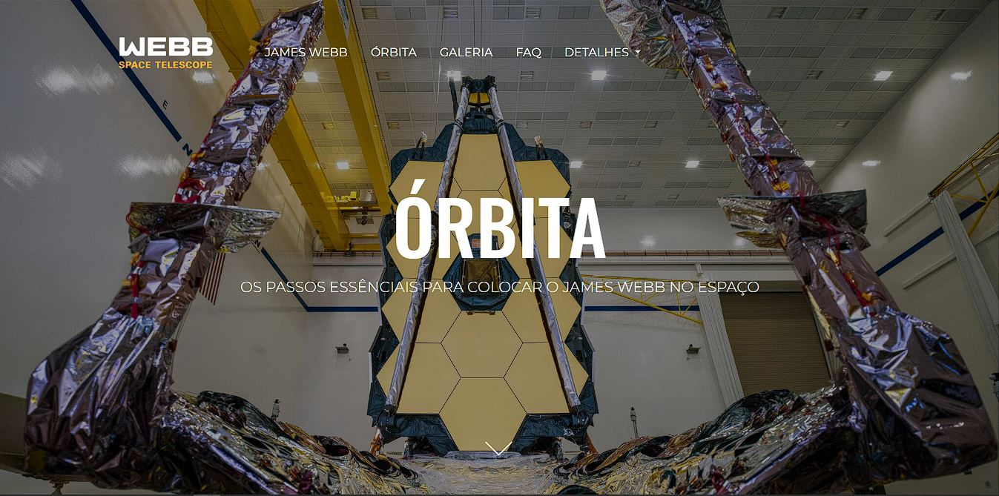
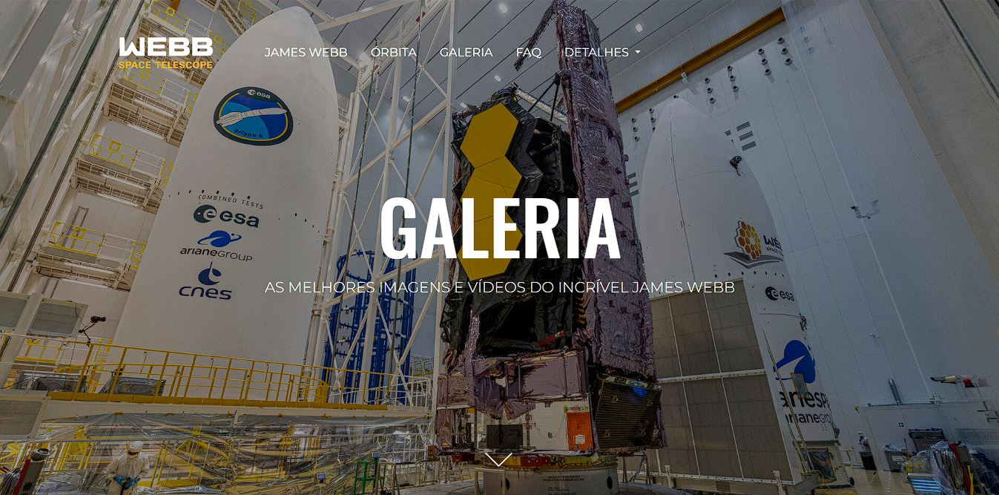

# James Webb Space Telescope :artificial_satellite:

## Descrição :page_with_curl:
Este projeto é uma página web que tem como objetivo fornecer informações sobre o Telescópio Espacial James Webb, o sucessor do Telescópio Espacial Hubble. :rocket:   
Veja abaixo algumas de suas características:
- Apresenta informações gerais do James Webb como suas características, objetivos e avanços científicos esperados. A página também fornece imagens e vídeos do telescópio em ação, além de uma seção de perguntas frequentes para esclarecer dúvidas sobre o projeto.

- Foi desenvolvido utilizando tecnologias web modernas, incluindo HTML5,CSS3 e Sass. O layout foi projetado com o framework Bootstrap para garantir uma visualização responsiva em diferentes tamanhos de tela.

- A página foi criada como parte de um projeto pessoal para apresentar informações relevantes e interessantes sobre o Telescópio Espacial James Webb de uma maneira acessível e intuitiva. Todos os materiais apresentados foram obtidos de fontes confiáveis e atualizadas para garantir a precisão das informações.

***
## Como acessar o site? :computer:

Para acessar o site **[clique aqui](https://gui-bus.github.io/jamesWebb/)**.

Espero que você goste do projeto e encontre todas as informações que precisa sobre a missão James Webb!

***

## Tecnologias utilizadas :dart:

 
  
  
  
  
  

  

***

## Contribuição :bulb:
Gostaria de contribuir para o projeto? Fico muito grato pelo interesse!
- Sinta-se à vontade para entrar em contato comigo através das minhas redes sociais para enviar suas mensagens, sugestões ou comentários sobre o projeto.

***

## Fontes e agracimentos :handshake:
Gostaria de expressar minha gratidão às seguintes fontes por sua contribuição para a criação deste projeto:
- A **[NASA](https://www.nasa.gov/)** por fornecer informações valiosas sobre a missão James Webb, que foram fundamentais a criação de conteúdo relevante.
- A **[ESA](https://esawebb.org/)** por fornecer imagens, vídeos e textos sobre o James Webb, que ajudaram a ilustrar e aprofundar o conteúdo do site.
- A **[OpenAI](https://openai.com/)** por fornecer textos úteis e informativos para algumas seções do site, o que ajudou a enriquecer o conteúdo.
- A **[OneBitCode](https://onebitcode.com/lp/)** por fornecer o conhecimento e as habilidades necessárias para a criação do site por meio do curso FullStack.   
Muito obrigado! :rocket:

***

## Redes sociais para contato! :speech_balloon:

